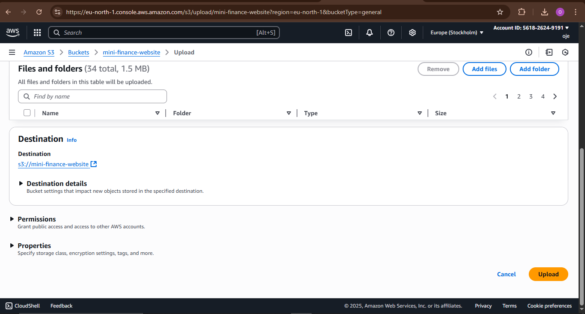

# How To Host a Static Website on AWS using S3.


A static website is a website made up of fixed content, usually HTML, CSS, and JavaScript files, that look the same for every visitor unless the code is manually changed.

It does not use a server-side language like PHP or a database to generate content dynamically, so it’s faster, cheaper to host, and ideal for portfolios, blogs, documentation, or landing pages.

## Advantages of Static Websites

1. **Simplicity:** Static websites are straightforward to create and deploy. They don’t require server-side scripting or databases, making them easier to manage.
   
2. **Speed:** Since static websites are pre-rendered and served directly to users, they load faster, reducing latency and improving the user experience.
   
3. **Cost-Effective:** Static websites can be hosted using simple web hosting services or cloud storage solutions, often at a lower cost than dynamic websites.
   
4. **Security:** Static websites have fewer vulnerabilities because they don’t involve server-side scripting or database interactions, reducing the risk of attacks.
   
5. **Scalability:** Static websites can handle high traffic easily because they are distributed via Content Delivery Networks (CDNs), like CloudFront, which replicate 
content across multiple servers worldwide.

6. **Reliability:** As static websites don’t rely on server-side processing, there is less chance of downtime due to server issues.
SEO-Friendly: Static websites can be optimized for search engines effectively due to their simplicity and faster load times.

**Examples of Static Websites:**

1. **Personal Blogs:** Many personal blogs are built as static websites since they primarily consist of articles, images, and a few interactive elements.

2. **Brochure Websites:** Small business websites that provide essential information about a company, its services, and contact details are often static.

3. **Documentation and Help Pages:** Technical documentation and help pages are usually static, as they are information-oriented and don’t require dynamic content.

4. **Landing Pages:** Landing pages used for marketing purposes are often static, showcasing a product or service with a clear call-to-action.
   
**What is Amazon S3?**  
Amazon S3 (Simple Storage Service) is a highly scalable, secure, and durable object storage service provided by Amazon Web Services (AWS). It allows you to store and retrieve any amount of data at any time from anywhere on the web. S3 is widely used for a variety of purposes, including hosting static websites, storing and distributing large files, backing up data, and serving as a content repository for web applications.

**Now lets host a static website using S3**  
You need to have an AWS account to use all AWS services including the S3 service which we will be using to host the static website, create an AWS account 

After creating and activating your AWS account, login and on the search bar of the AWS console, search for S3.


On the S3 dashboard, click “create bucket”


Enter a unique name for your bucket, this is important because S3 bucket names are globally unique, then select the region you want the bucket to be hosted in.


Scroll down and click on ACLs (Access Control Lists) enabled, this will allow you to specify access to the bucket using Access Control Lists.


Now, uncheck “Block all Public access”. This allows your bucket contents to be publicly accessible.


It is worth noting that making the bucket publicly accessible is not a good security practice so we will make the bucket and our website secure.  
Please note that I unchecked the option as a temporary measure to test if our website can be accessed while hosted on S3. However, we will promptly turn it back on once we confirm its functionality because leaving the option “Block all public access” unchecked exposes our website content and data to the public internet, including potential hackers and malicious entities, making it insecure.

**Keep all other contents at their default settings and proceed by clicking on the “create bucket” option.**


Now, click on the bucket name from the list of buckets and click upload.


Next, click add files or add folders to add the html, css and javascript files of your website.


When you are done adding your website files and folders, click on upload.


`note! when uploading your files, do not click on upload folder, rather, create folders and upload file contents as seen on your local computer.`

Configure S3 Bucket Permissions for Website Access. Click on the permissions tab in your S3 bucket, click on edit permission, and paste the JSON configuration below:
```{
    "Version": "2008-10-17",
    "Id": "PolicyForCloudFrontPrivateContent",
    "Statement": [
        {
            "Sid": "AllowCloudFrontServicePrincipal",
            "Effect": "Allow",
            "Principal": {
                "Service": "cloudfront.amazonaws.com"
            },
            "Action": "s3:GetObject",
            "Resource": "arn:aws:s3:::YOUR_BUCKET_NAME/*",
            "Condition": {
                "StringEquals": {
                    "AWS:SourceArn": "arn:aws:cloudfront::396529431040:distribution/E2TM1KE84PM7EN"
                }
            }
        }
    ]
} 
```


This policy allows CloudFront to distribute Objects (website contents) from the specified S3 bucket (“Resource”: “arn:aws:s3:::YOUR_BUCKET_NAME/*”) to edge locations.
Replace the “YOUR_BUCKET_NAME” in the configuration with your bucket name and click on save.

Next, click on properties tab, scroll down to static hosting and click on it, by default it is disabled, click on “Enable”. Under index document, type the index document of your website (index.html). If your website has an error page (e.g 404 error page), you can optionally type the error page under “Error document — optional”.


The website has been successfully hosted on S3. To access it, simply scroll down and locate the “Bucket website endpoint.” Copy this endpoint and paste it into your web browser, granting you full access to our website.


## Thank you for reading, I hope you have learnt how to host a static website using Amazon S3. We will make the website secure and use a custom domain in another article.